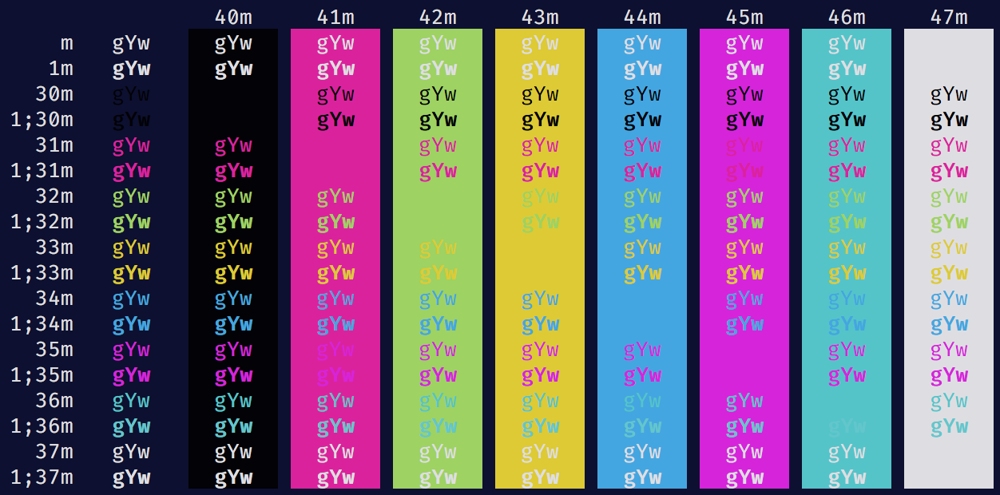
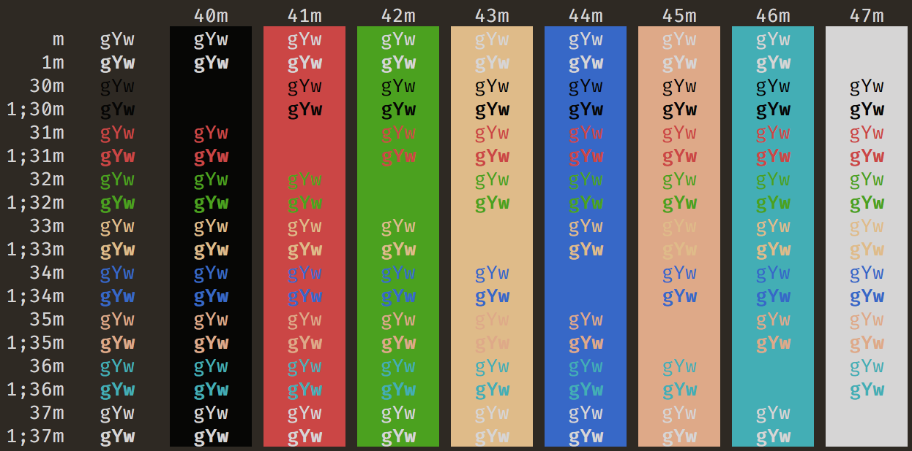

## 📺 Welcome to 1984 📺

### **80s Neon-Styles for iTerm 2**

### Installation
* Clone this repository
* Open iTerm 2 and go to Preferences -> Profiles -> Colors
* Choose `Import...` from the `Color Presets` dropdown
* Find the `.itermcolors` file of the theme you want to use and click `Open`
* Now select the imported theme from the `Color Presets` dropdown

### Themes
#### 1984

#### 1984 - Light

#### 1984 - Orwellian

### Credit
* Inspiration comes from [juanmnl](https://github.com/juanmnl)'s [vs-1984 theme](https://github.com/juanmnl/vs-1984) for VSCode.
* Screenshots are courtesy of a tool created by [mbadolato](https://github.com/mbadolato) and can be found in [this repo](https://github.com/mbadolato/iTerm2-Color-Schemes).
